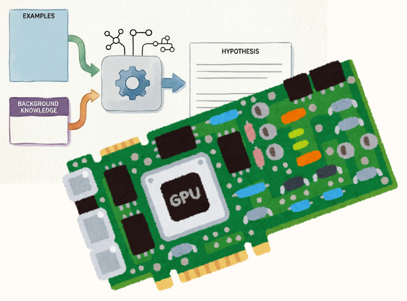

# CUD@ILP

CUD@ILP is a CUDA-accelerated extension of the FOLD-RM algorithm for binary classification tasks.

The project is based on FOLD-RM (https://github.com/hwd404/FOLD-RM), an Inductive Logic Programming (ILP) framework that learns default theories represented as Answer Set Programs (ASP). ASP is a declarative logic programming paradigm that supports negation and is interpreted under stable model semantics.

<p align="center">
  
</p>

## Repository Overview

This branch extends the original FOLD-RM implementation with GPU acceleration and additional experimental features.
This branch contains the version described in the paper **CUD@ILP: a GPU-based Massively Scalable Inductive
Learning Algorithm**

**Average Speedup with respect to FOLD-RM: 12×**

---

## Usage

CUD@ILP can be used in the same way as the original FOLD-RM implementation.

### Serial Training

```python
model.fit(...)
```

### CUDA Training

```python
model.fitGPU(...)
```

---

## Testing

The `Run_tests.py` script provides a simple benchmark for comparing the serial and CUDA implementations.

The script:

1. Trains a model using the original serial implementation (`model.fit`).
2. Trains the same model using the CUDA implementation (`model.fitGPU`).
3. Measures and compares execution times.
4. Verifies that both implementations produce the same learned hypothesis.

Since the datasets are currently split deterministically into training and testing sets, the hypotheses produced by the serial and CUDA versions should be identical.

---

## Notes

* The testing framework is intentionally lightweight and primarily intended for development and validation.
* The CUDA implementation aims to improve training performance while preserving the behavior of the original FOLD-RM algorithm, same input output format and accuracies.
