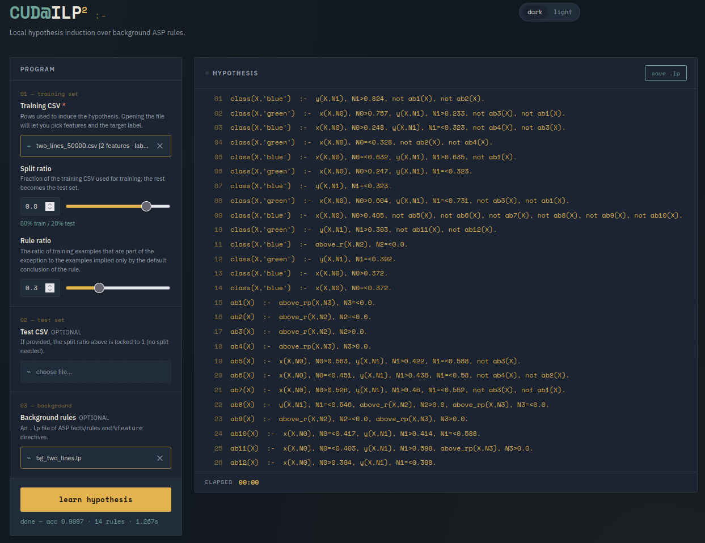

# CUD@ILP <sup>2</sup>


**CUD@ILP²** is a CUDA-accelerated extension of the **CUD@ILP (FOLD-RM)** algorithm for binary and multiclass classification tasks.

The project is based on [FOLD-RM](https://github.com/hwd404/FOLD-RM), an Inductive Logic Programming (ILP) framework that learns default theories represented as Answer Set Programs (ASP). ASP is a declarative logic programming paradigm that supports negation and is interpreted under stable model semantics.

By learning default rules together with their exceptions, FOLD-RM generates compact and interpretable models that closely resemble human commonsense reasoning.

CUD@ILP² provides a significative speedup over FOLD-RM, supports the addition of user-defined background rules (in Clingo syntax), and is able to summarize the hypothesis in natural language.

<br clear="right"/>

## Repository Overview

This branch extends the original CUD@ILP implementation with more GPU acceleration and additional experimental features.

**Average Speedup with respect to FOLD-RM: 20×**

---

## Usage

CUD@ILP<sup>2</sup> can be used via Python in the same way as the original FOLD-RM implementation (without background rules).
In addition, a set of background rules can be specified (see main_example.py), moreover an optional LLM can be invoked to sum up and explain in NL the final hypothesis.
A web-interface can also be used.


### Serial Training

```python
model.fit(...)
```

### CUDA Training

```python
model.fitGPU(...)
```
#### To add background rules, a background file must be specified.

### Interface (CUDA only)
Run run_CUD@ILP2_GUI.py, it will init a local Flask server and open a browser based interface for CUD@ILP<sup>2</sup>.
<p align="center">
  
</p>

---

### Testing

The the results obtained in the paper can be replicated via the script `Run_tests.py`.
